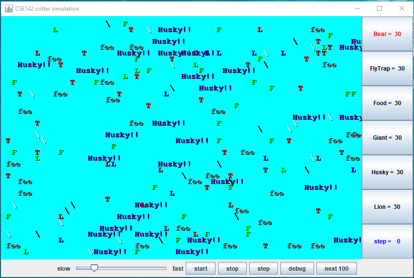

# Java-Critter
Graphical simulation of a 2D world of animals with several client program classes

# About
This Assignment focuses on classes and objects. By designning, developing and testing 4 class: Bear.java, Lion.java, Giant.java, and Husky.java. Finally runned given CritterMain.java to start the simulation. 

 The simulation looks like this: 
 

 The fully assignment description could be found under Assignment - Description folder.
